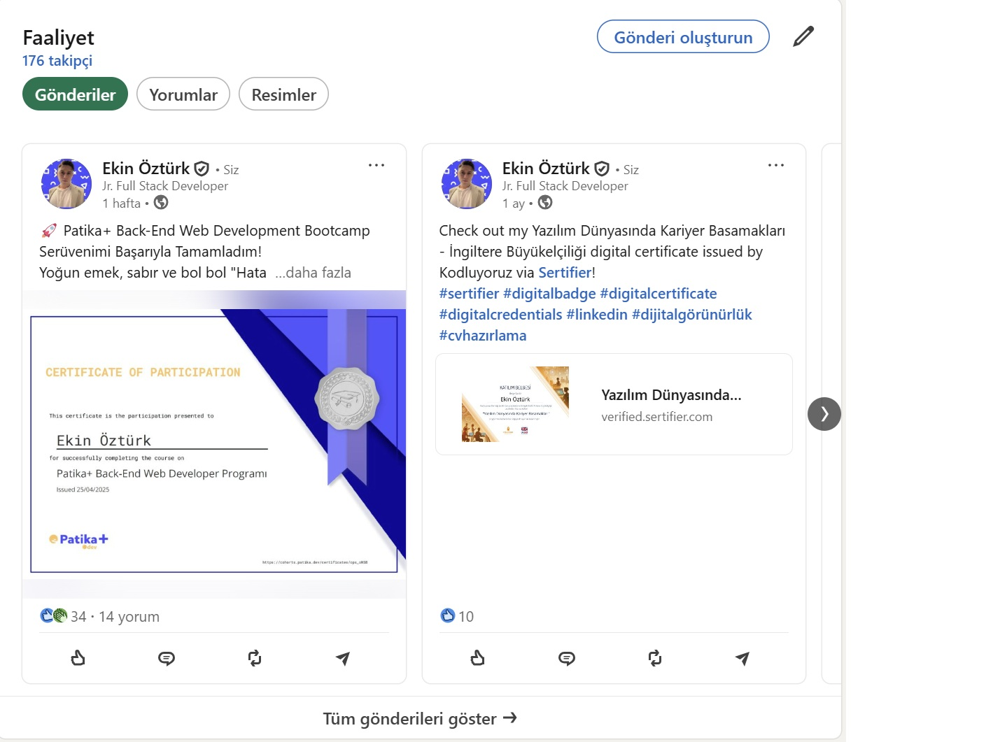
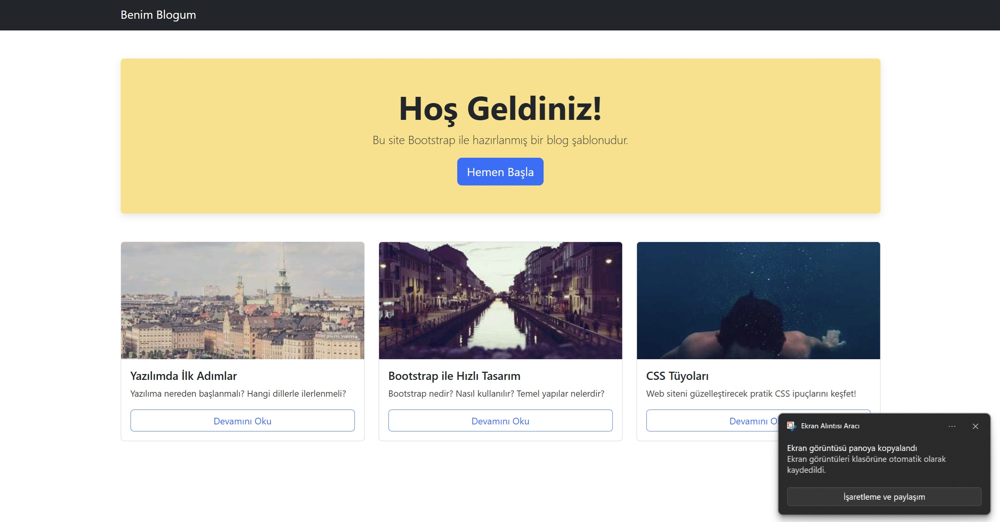

# 📝 Benim Blogum

Bu proje, [Bootstrap 5](https://getbootstrap.com/) kullanılarak hazırlanmış sade ve şık bir blog anasayfası örneğidir.  
Koyu temalı menüsü, jumbotron alanı ve eşit boyutlu blog kartlarıyla, responsive ve modern bir web tasarımı hedeflenmiştir.

## 🚀 Proje Özellikleri

- ✅ Koyu renkli responsive Navbar
- ✅ Tanıtım için jumbotron bölümü
- ✅ 3 adet eşit boyutlu blog kartı
- ✅ Dışarıdan bağlanan stil dosyası (`style.css`)
- ✅ Bootstrap 5 ile uyumlu mobil tasarım
- ✅ Sıfırdan elle kodlanmıştır, hazır template kullanılmamıştır.

---

## 🧑‍💻 Geliştirici

Merhaba, ben Ekin Öztürk!  
10+ yıllık spor geçmişim ve yazılım dünyasına olan tutkumla projeler geliştiriyorum.  
Aşağıdaki bağlantıdan benimle iletişime geçebilir, çalışmalarımı inceleyebilirsin 👇

---

## 📂 Proje Görseli

